# SerinoTest
For serino technical test

Create an algorith to automatically populate the database, search for treasure by coordinate, distance and prize value. the distance calculation was taken from [http://www.movable-type.co.uk/scripts/latlong.html](http://www.movable-type.co.uk/scripts/latlong.html, it uses the ‘**haversine**’ formula to calculate the great-circle distance between two points. cross checked with other online distance calculator for coordinates and the result is correct.

This system uses [nodeJS](https://nodejs.org/en/) as the runtime environment, [expressJS](https://expressjs.com/) as the framework, [mongoDB Community Server](https://www.mongodb.com/) as the database and [mongoose](https://mongoosejs.com/) as the ODM library for mongoDB.

## Download and execute [mongoDB](https://www.mongodb.com/try/download/community)

### Or check [MongoDB installation Tutorials](https://www.mongodb.com/docs/manual/installation/#mongodb-installation-tutorials)

### For Windows
1. Download community server database download
    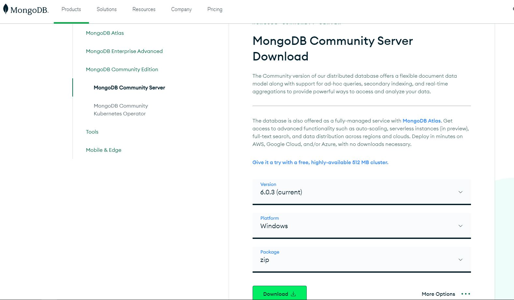
2. After download completes extract the zip file(mongodb-windows-x86_64-6.0.3) to desired location
    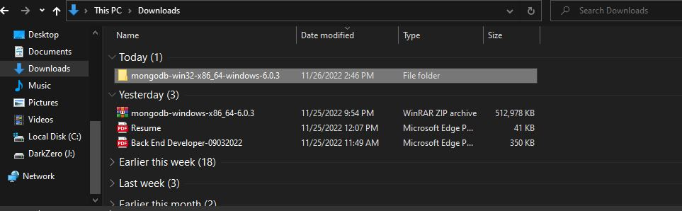
3. Open command prompt and goto extracted file and goto bin folder(`cd C:/location/of/extracted/file/mongodb-win32-x86_64-windows-6.0.3/bin`)
    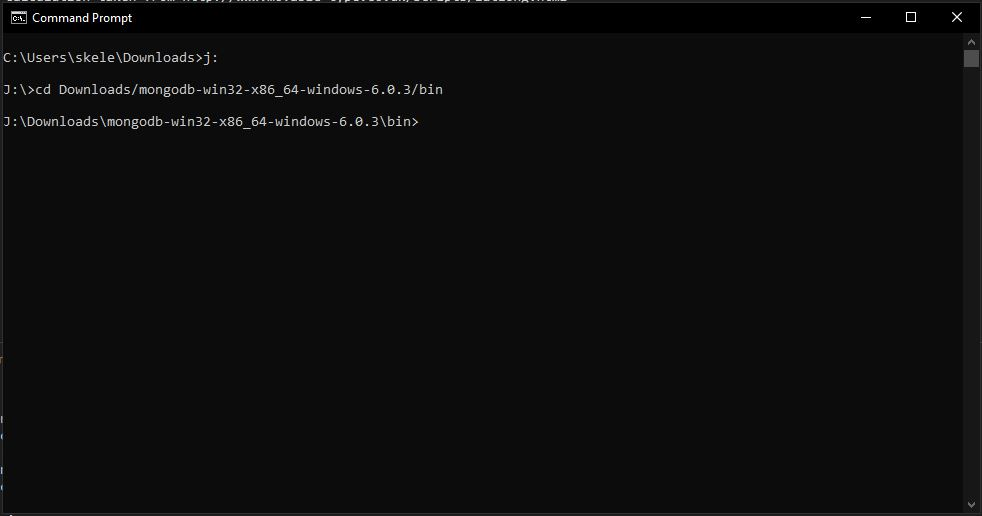
4. Create directory "data"
    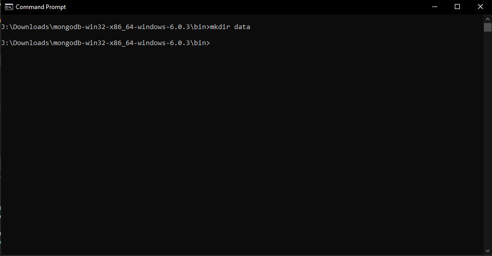
5. Execute command `monggod.exe --dbpath ./data` to run the database server
    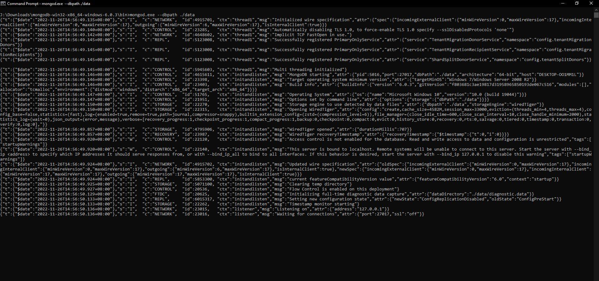
6. To check if the database is working goto to [localhost:27017](http://localhost:27017/), and it will show *It looks like you are trying to access MongoDB over HTTP on the native driver port.*
    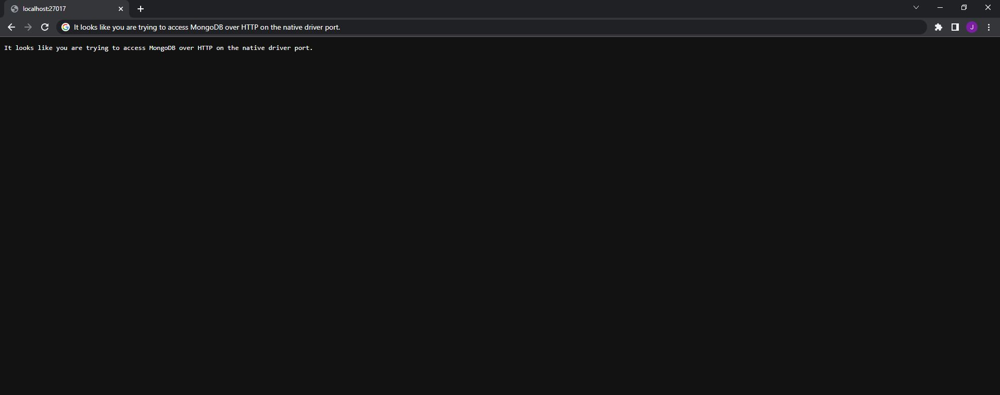

## Execute The System

1. [Download And Execute MongoDB server](#download-and-execute-mongodb)
2. Open command prompt and goto to system location(`C:\Mine\basic\serinoTest`)
    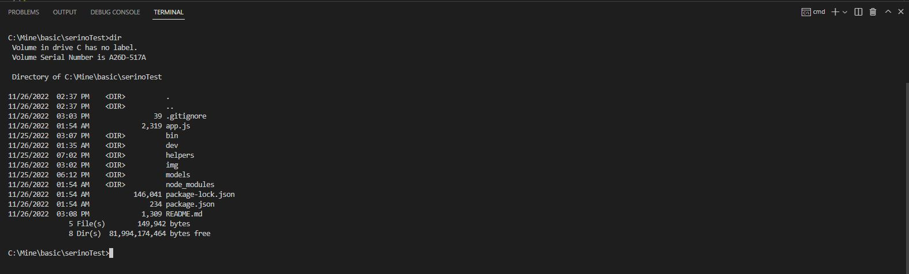
3. To populate data execute command `npm run populate`, to automatically populate database with the given sample
    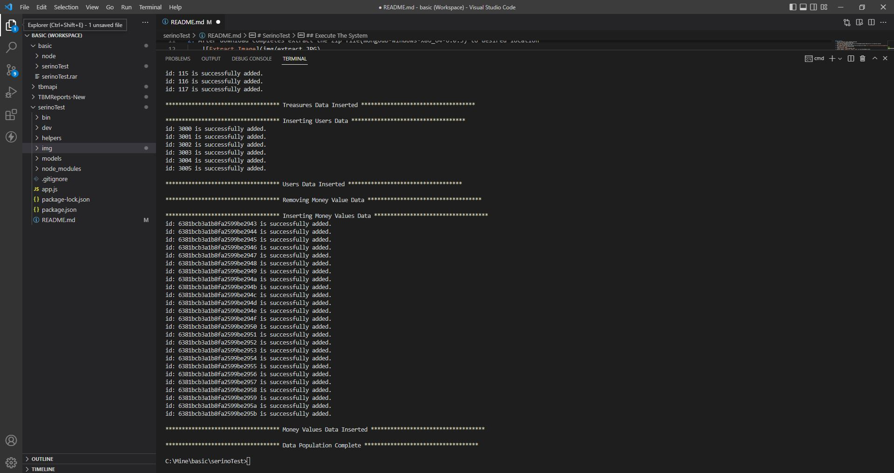
4. To start the system execute command `npm start`(*the system url will be [localhost:3000](http://localhost:3000)*)
    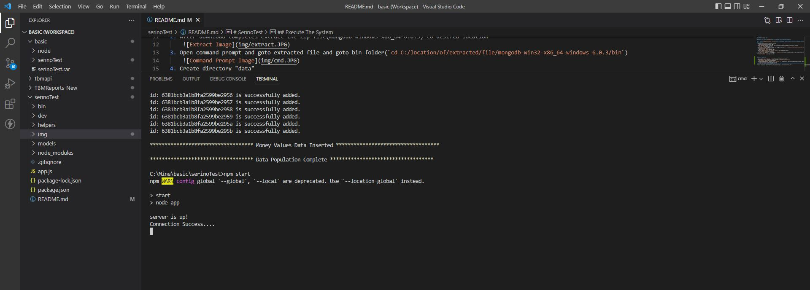

## Routes Available in the System Example

### Request(Example #1)

`GET localhost:3000/nearMe?latitude=14.552036595352455&longitude=121.01696118771324&distance=1`

    {
        latitude:14.552036595352455,
        longitude:121.01696118771324,
        distance:1 //accepts only 1 or 10 as the value
    }

### Response

    [
        {
            "_id": "6381bcb3a1b8fa2599be2926",
            "id": 100,
            "latitude": 14.54376481,
            "longitude": 121.0199117,
            "name": "T1"
        },
        {
            "_id": "6381bcb3a1b8fa2599be2928",
            "id": 102,
            "latitude": 14.54464357,
            "longitude": 121.0203656,
            "name": "T3"
        }
    ]

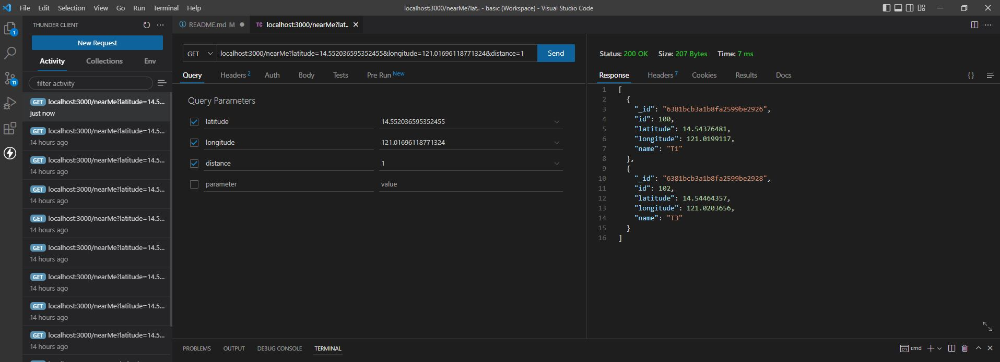

### Request(Example #2)

`GET localhost:3000/nearMe?latitude=14.552036595352455&longitude=121.01696118771324&distance=1&prize_value=10-30`

    {
        latitude:14.552036595352455,
        longitude:121.01696118771324,
        distance:1, //accepts only 1 or 10 as the value
        prize_value:10-30 //optional parameter. accepts only range from 10-30 and strictly no decimal value
    }

### Response
    [
        {
            "_id": "6381bcb3a1b8fa2599be2926",
            "id": 100,
            "latitude": 14.54376481,
            "longitude": 121.0199117,
            "name": "T1",
            "value": {
            "_id": "6381bcb3a1b8fa2599be2943",
            "treasure_id": 100,
            "amount": 15,
            "__v": 0
            }
        },
        {
            "_id": "6381bcb3a1b8fa2599be2928",
            "id": 102,
            "latitude": 14.54464357,
            "longitude": 121.0203656,
            "name": "T3",
            "value": {
            "_id": "6381bcb3a1b8fa2599be2945",
            "treasure_id": 102,
            "amount": 15,
            "__v": 0
            }
        }
    ]

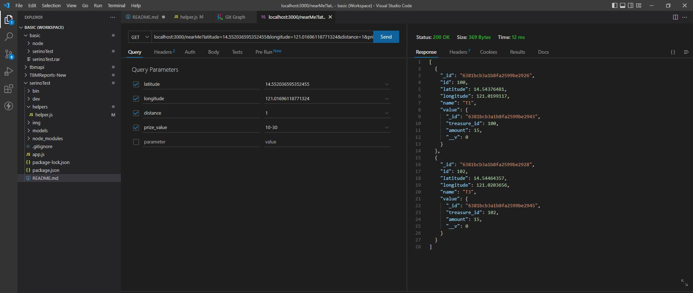